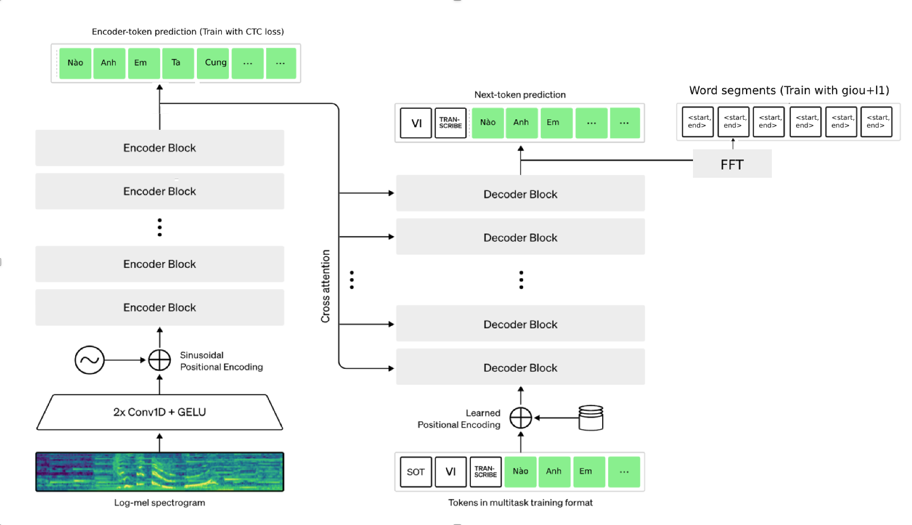

# WKaraokeMaker
## Description

This work earns first place solution (on private test) of [ZAC2022](https://challenge.zalo.ai/portal/lyric-alignment/final-leaderboard), LyricAlignment Track.

## What is Karaoke Maker?

Karaoke Maker is a task that predicts the lyrics and melody of the given music audio. 
It is a task that can be used in various fields such as music production and karaoke you name it.
## Method
* Since the provided gt is too noisy. We first precompute loss scale for each word in the lyrics. The loss scale generally is the iou between output of force alignment(https://pytorch.org/tutorials/intermediate/forced_alignment_with_torchaudio_tutorial.html) and the provided gt. If the iou is less than a certant threshold, we set the loss scale to 0. Otherwise, we set it to 1.

* We modified whisper model to fit the competition task. An extra head is added to the encoder and trained with ctc loss.
The decoder is extended withan `word_seg_embed` head  to predict the word segments (start, end). We simply trained it with giou+l1 loss. The other part is kept the same as the original whisper model.
Please take a look at, kmaker/model.py for more details.
### Pipeline

## Installation
* ffmpeg # for audio/video processing
* python >= 3.8
* pytorch torchaudio

```bash
    conda create -n kmaker python 3.8
    # Install pytorch https://pytorch.org/get-started/locally/
    pip install git+https://github.com/openai/whisper.git 
    pip install -r requirements
    pip install -e ./
```
Download pretrained and save to pretrained/whisper_karaoke_base_vn.pth
```
https://drive.google.com/file/d/1zHZ7DYRghu9VTtT_P2G74Gky-68cUcl-/view?usp=share_link
```
## Usage
```bash
    python tools/predict_one_song.py asset/12300.json --audio_file asset/12300.mp3 --output_file output/12300.mp4
```

## Example karaoke video
[](https://youtu.be/16RjtOygs7o)


## Colab Demo
[](https://colab.research.google.com/drive/1lDnOOu1sVjz47yIkyDrmZiBDG0ydrSMx#scrollTo=mcOq0HfMxA87)


## Limitation
* The current model only trained on Vietnamese music dataset
* Length of the audio must be less than 30s
